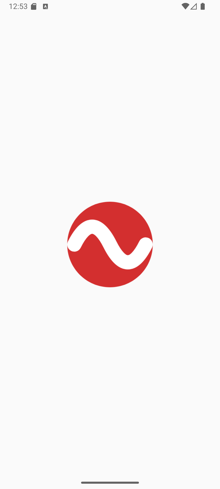
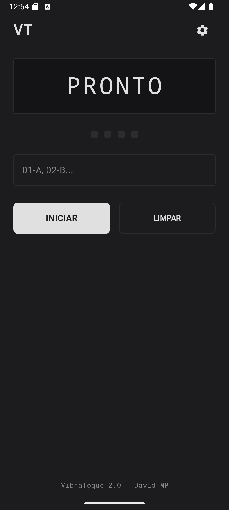
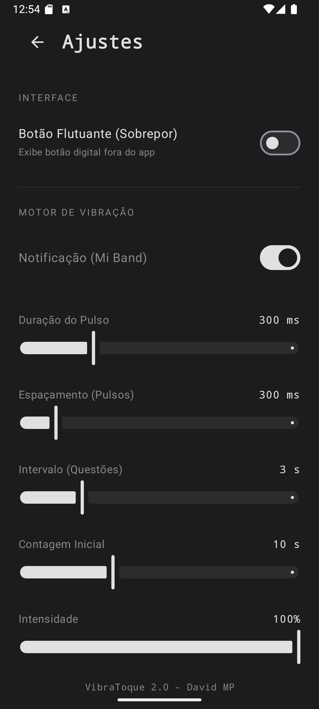

📳 VibraToque 2.0

A Revolução da Comunicação Háptica Silenciosa.
Converta códigos digitais em sinais físicos discretos.

🚀 Visão Geral

O VibraToque é uma ferramenta Android de engenharia de software desenvolvida para transcender as barreiras da comunicação visual. Utilizando o motor de vibração do smartphone e protocolos de notificação wearable, o aplicativo converte sequências alfanuméricas (códigos) em padrões rítmicos de vibração.

Projetado com foco em acessibilidade, discrição e precisão, o VibraToque permite que o usuário receba informações complexas sem precisar olhar para a tela, através de um sistema inteligente de mapeamento de caracteres para pulsos físicos.

🛠️ Funcionalidades Principais

📡 Transmissão Híbrida de Sinais

O sistema opera em dois modos distintos de saída de sinal:

Modo Local: Utiliza o atuador de vibração do próprio smartphone com controle total de amplitude via API VibrationEffect.

Modo Wearable (Mi Band Protocol): Um sistema inteligente que converte os pulsos em notificações sequenciais únicas, permitindo que pulseiras inteligentes (como a Mi Band) interpretem e vibrem no pulso do usuário, mantendo o smartphone em silêncio absoluto.

🎛️ Controle Háptico de Precisão

Diferente de vibradores comuns, o VibraToque oferece um painel de engenharia para ajuste fino:

Duração do Pulso: Milissegundos exatos de cada vibração.

Latência de Sinal: Controle do espaçamento (delay) entre pulsos e entre blocos de código.

Intensidade: Modulação da força do motor vibratório.

👻 Interface Overlay Furtiva (Botão Flutuante)

Inclui um Serviço de Primeiro Plano (Foreground Service) que projeta um botão discreto (estilo biométrico/digital) sobre qualquer outro aplicativo do sistema.

Permite o acionamento manual de sinais sem abrir o app principal.

Design transparente para mínima interferência visual.

🛡️ Protocolo de Segurança e Alerta

Contagem Regressiva Tática: O sistema permite configurar um timer de preparação antes de iniciar a transmissão do fluxo de dados.

Feedback de Inicialização: Alerta tátil duplo para confirmar o início da operação sem necessidade de confirmação visual.

🧠 Lógica de Operação

O algoritmo de interpretação do VibraToque segue um padrão lógico rigoroso para garantir a integridade da mensagem:

Input de Dados: O usuário insere uma sequência de códigos (Ex: 01-A, 02-C, 03-B).

Parsing: O app extrai os identificadores e as variáveis de valor.

Conversão:

Variável A: 1 Pulso Tátil

Variável B: 2 Pulsos Táteis

Variável C: 3 Pulsos Táteis

Variável D: 4 Pulsos Táteis

Variável E: 5 Pulsos Táteis

Transmissão: O sinal é enviado respeitando os intervalos configurados para garantir a distinção entre cada pacote de informação.

📱 Telas e Interface

Design Minimalista "Dark Mode" para conforto visual e baixo consumo de energia em telas AMOLED.

Tela Principal

Configurações

Botão Flutuante

![DOWNLOAD VERSÃO ATUALIZADA] (https://github.com/davidmp24/VibraToque/releases/download/VibraToque/VibraToque.2.0.Atualizado.apk) 

💻 Tecnologias Utilizadas

Linguagem: Kotlin

Interface: Jetpack Compose (Material Design 3)

Arquitetura: MVVM Clean Architecture

Concorrência: Kotlin Coroutines & Flow

Serviços de Sistema:

VibratorManager & VibrationEffect (Controle de Hardware)

NotificationManagerCompat (Integração Wearable)

WindowManager (Overlay/Draw Over Apps)

📥 Instalação

Clone este repositório.

Abra no Android Studio Ladybug (ou superior).

Compile o projeto.

Importante: Ao instalar, conceda as permissões de Notificação e Sobreposição a outros apps para desbloquear o potencial máximo da ferramenta.

🤝 Autor

David MP
Desenvolvedor Mobile & Engenheiro de Software

GitHub

VibraToque © 2025. Código proprietário para fins educacionais e de desenvolvimento.